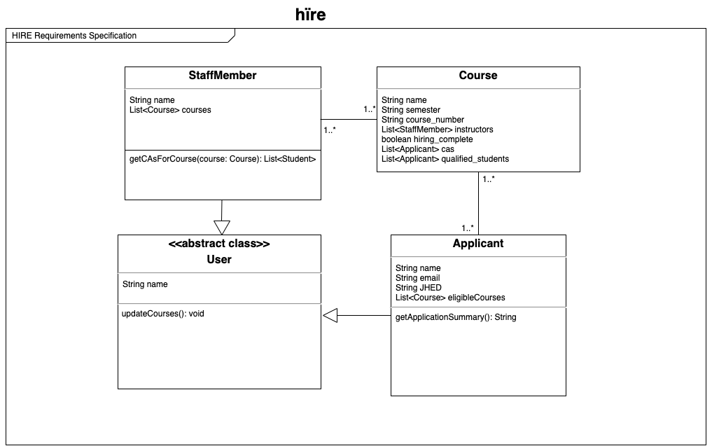
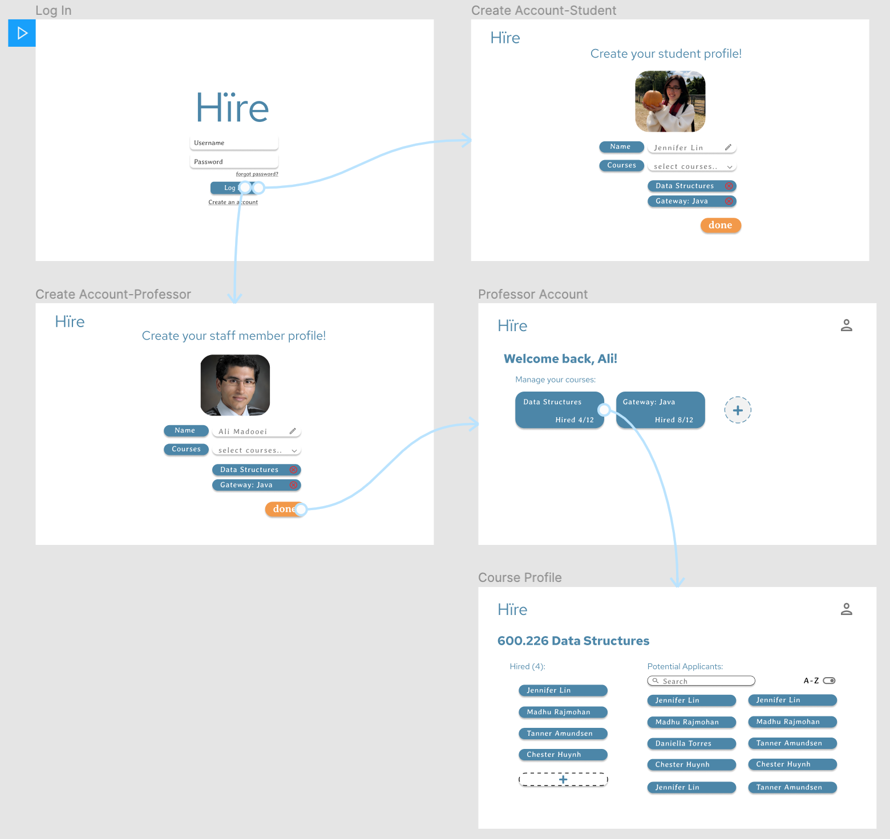

# OO Design
A UML class diagram reflecting the "model" for that iteration only.
Use a software to draw this (e.g. draw.io) and save the diagram as an image. 
Upload the image and link it in here using this syntax.

# Wireframe
One (or a few) simple sketch of how the user interacts with the application. 
This could be a sketch of your user interface. 
You can draw it by hand and insert it here as an image.

# Iteration Backlog
List the User Stories that you will implement in this iteration.

- As a CA applicant I want to be able to fill out an application.
- As a CA applicant I want to be able to select all the courses I’ve taken from a drop down so that I don’t have to write them myself.
- As a CA applicant I want to be able to login.
- As a staff member, I want to be able to login.
- As a staff member, I want to mark myself as the professor of the courses that I teach from a list of all CS courses.
- As a staff member, I want to view the courses that I teach in list form.
- As a staff member, I want to view the names of the CA applicants that have applied to a given course that I am teaching.
- As a staff member, I want to see the full application of a CA applicants that have applied to a given course that I am teaching.

# Tasks
A tentative list of the "to do" in order to sucessfully complete this iteration. 
This list will change and it is good to keep it updated. 
It does not need to be exhustive.

- Login
    - Login page (frontend)
    - Check box to select either staff member or student
    - Send JHED and profileType to landing page
- SignUp
    - Make everything required fields
    - For each course selected, find course object from Courses database and add to list of eligible courses
    - Create new Applicant object and add to Applicants database
    - Send JHED and profileType to landing page
- After user signs up as a staff member or student, they must complete their profile page
- Courses database
    - Hardcode CS classes into DB for each semester
- For staff member:
    - Course page:
        - Enter course details (enter “job” description) to be visible to student
        - Display all applicants for the course
        - Display all hired applicants for the course
        - Allow professors to see if the candidate is also desired by other staff members
- For students:
    - For each course they want to apply to CA for:
        - Enter course details (if they have taken the course before + if so, then what grade, and if they have CAd for the course before) to submit the full application 
<!-- Allow student to rank their course preferences -->

