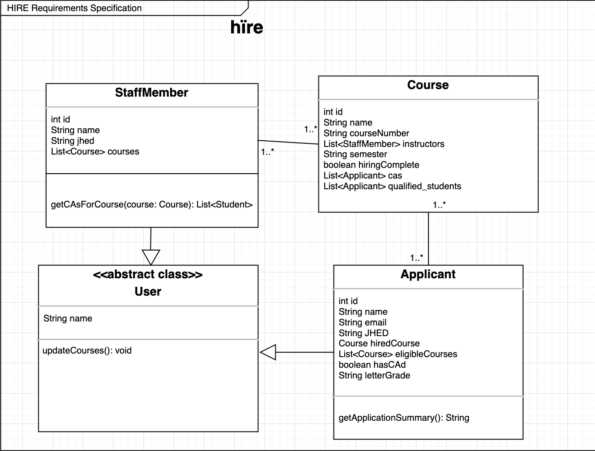
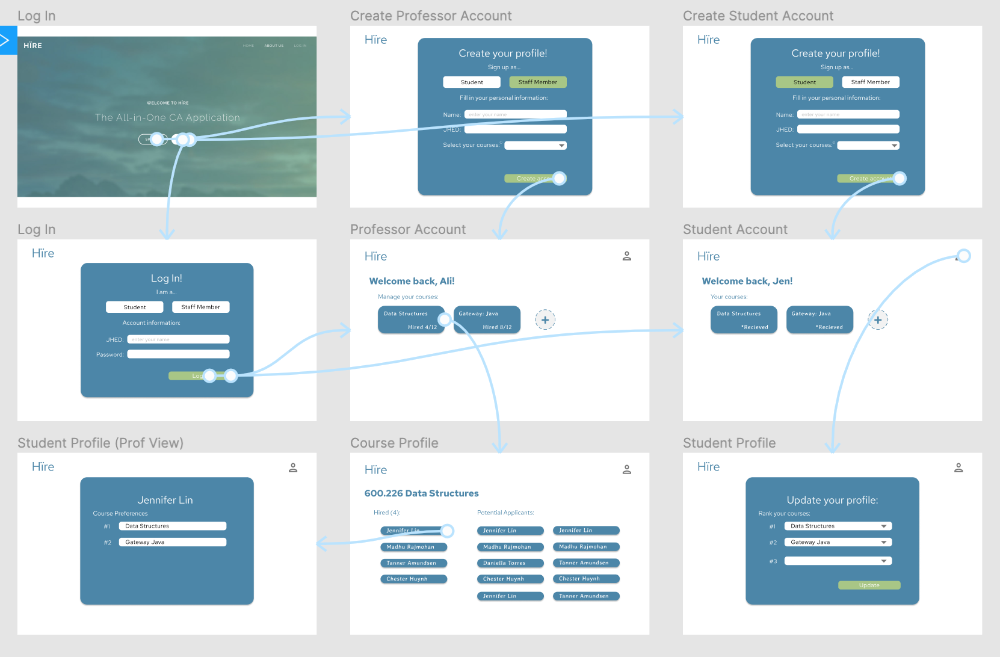

# OO Design
A UML class diagram reflecting the "model" for that iteration only.
Use a software to draw this (e.g. draw.io) and save the diagram as an image. 
Upload the image and link it in here using this syntax.

# Wireframe
One (or a few) simple sketch of how the user interacts with the application. 
This could be a sketch of your user interface. 
You can draw it by hand and insert it here as an image.

# Iteration Backlog
List the User Stories that you will implement in this iteration.

- As a CA applicant I want to be able to login so that I can view my pending applications.
- As a staff member, I want to be able to login so that I can manage my open listings.
- As a CA applicant I want to be able to select all the courses I’ve taken from a drop down so that I don’t have to write them myself.
- As a CA applicant, I want to be able to create a personal profile to rank my first, second, third choice course so that professors can take my preferences into account.
- As a staff member, I want to be able to select all the courses I’m teaching from a drop-down so that I don’t have to write them myself.
- As a staff member, I want to view the courses that I teach in list form so I can stay organized.
- As a staff member, I want to know if the student has taken my course and the grade they got, and if they have CAd for my course before, so that I can filter who is the most qualified.
- As a staff member, I want to view the names of the potential CA applicants so that I can keep track of who is interested in assisting my course.
- As a staff member, I want to see the full application of CA applicants that have applied to a given course that If am teaching so that I can compare applicants.

# Tasks
A tentative list of the "to do" in order to sucessfully complete this iteration.
This list will change and it is good to keep it updated.
It does not need to be exhustive.

- Login
  - Login page (frontend)
  - Check box for: staff member or student
  - Send jhed and profileType to landing page
- SignUp
  - Make everything required fields
  - For each course selected, find course object from Courses database and add to list of eligible courses
  - Create new Applicant object and add to Applicants database
  - Send jhed and profileType to landing page
- Courses database
  - Hardcode CS classes into DB each semester
- After user signs up as a staff member or student, then they must complete their profile page
- For staff member:
  - Course page:
    - Enter course details (enter “job” description) to be visible to student
    - Display all applicants for the course
    - Display all hired applicants for the course
    - Click on an applicant to see their profile - grades and course preferences
- For students:
  - For each course they want to apply to CA for:
    - enter course details (if they have taken the course before + if so, then what grade, and if they have CAd for the course before) to submit the full application 
  - Allow student to rank their course preferences (top three choices)

# Retrospective

## Accomplishments from iteration 2

- StudentView created for professors to see applicants’ information
- Created studentprofile view where students can rank the courses they have taken
  - In the same profile editor, students can add the grades they receieved
- Courseinfo created
- Grade class created to view grades in the studentview.hbs
- The ability to login (before could only signup)
  - Integrated frontend and backend to allow users to signup and login
- SIS integration: We added all CS courses from the SIS API and made it accessible via a dropdown from which students and professors choose their courses
- Professor’s landing (profile) page shows the courses that their hiring for
- Updated testing of all persister classes

## Features we did not deliver

- We do not implement an applicant filtering ability for staff members, however they can see student profiles which include their grade, whether or not they have taken the course, and the student’s top-ranked courses.

## Challenges and plans for next iteration

- We ran into an issue in the student profile part of our website where after a student inputs the grades they got for all the courses they’ve taken, we couldn’t find a way to retrieve their grades and update the database. We overcame this issue by creating a Grade.java POJO so that we could make an ArrayList of Grade objects to add to our database.
- School shutting down forced us to shift to online collaboration across 3 different timezones. It was hard to not be able to meet in person to discuss high-level design decisions but we were able to make use of Zoom, Google Drive and a group chat to divide work and accomplish everything in our iteration backlog.
- We want to continue using the “tasks” feature on Github to organize what needs to be done for our next iteration. We want to continue to make sure all team members have a working knowledge of both frontend and backend functionalities.