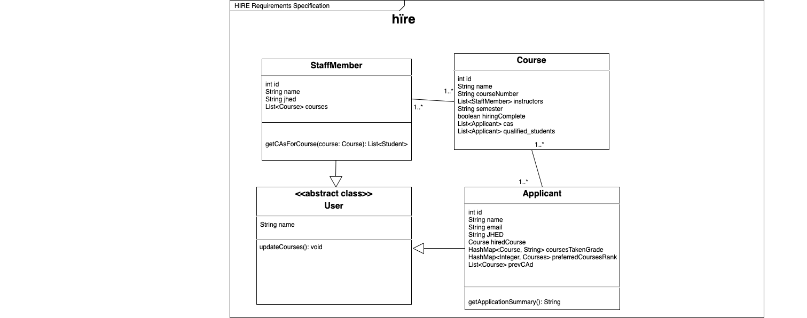

# OO Design
A UML class diagram reflecting the "model" for that iteration only.
Use a software to draw this (e.g. draw.io) and save the diagram as an image. 
Upload the image and link it in here using this syntax.

# Wireframe
One (or a few) simple sketch of how the user interacts with the application. 
This could be a sketch of your user interface. 
You can draw it by hand and insert it here as an image.

# Iteration Backlog
List the User Stories that you will implement in this iteration.

- As a CA applicant I want to be able to login so that I can view my pending applications.
- As a staff member, I want to be able to login so that I can manage my open listings.
- As a CA applicant I want to be able to select all the courses I’ve taken from a drop down so that I don’t have to write them myself.
- As a CA applicant, I want to be able to create a personal profile to rank my first, second, third choice course so that professors can take my preferences into account.
- As a staff member, I want to be able to select all the courses I’m teaching from a drop-down so that I don’t have to write them myself.
- As a staff member, I want to view the courses that I teach in list form so I can stay organized.
- As a staff member, I want to know if the student has taken my course and the grade they got, and if they have CAd for my course before, so that I can filter who is the most qualified.
- As a staff member, I want to view the names of the potential CA applicants so that I can keep track of who is interested in assisting my course.
- As a staff member, I want to see the full application of CA applicants that have applied to a given course that If am teaching so that I can compare applicants.

# Tasks
A tentative list of the "to do" in order to sucessfully complete this iteration. 
This list will change and it is good to keep it updated. 
It does not need to be exhustive.

- Login
    - Login page (frontend)
- Create classes (backend)
    - Hardcode CS classes into DB each semester
    - Course, Staff Member, Applicant, User (abstract class)
    - Create CRUD/persistence, Sql2o for above courses
- Profile creation
    - Get information for user profiles
        - Students: Name, email, eligible courses to CA (model off CA application)
        - Staff: Name, courses teaching 
    - Create onboarding pages (frontend)
        - Display profile to students/staff members after finishing
- Visualization from database
    - Display all hired applicants for each course
    - Display all potential applicants for each course

