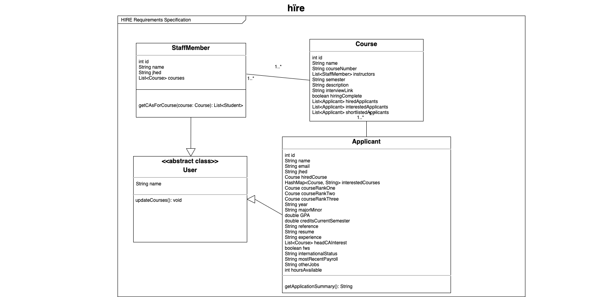

# OO Design
A UML class diagram reflecting the "model" for that iteration only.
Use a software to draw this (e.g. draw.io) and save the diagram as an image.
Upload the image and link it in here using this syntax.

# Wireframe
One (or a few) simple sketch of how the user interacts with the application.
This could be a sketch of your user interface.
You can draw it by hand and insert it here as an image.

# Iteration Backlog
List the User Stories that you will implement in this iteration.

- As a staff member, I’d like to see whether a student has CAd for that course, whether a student has taken courses that have the course as a prerequisite, and if the student has CA’d for the prerequisite course so that I can hire the right candidate.
- As a staff member looking to hire CAs, I want to note when I conduct interviews/hire students so that I can keep a better track of each application’s progress.
- As a staff member, I want to be able to shortlist applicants so that I can aggregate preferred candidates for a given course.
- As a CA applicant, I want changes to my application status to be displayed (application received, getting an interview, getting hired etc.) so I’m aware of the status of my application.
- As a CA applicant, I want to have an all-in-one and intuitive profile where I can input and update qualifications so that I can apply for many positions through one application across semesters.
  - As a CA applicant, I want to be able to input information about my experiences and preferences so that professors have more information about my application when considering me as a candidate.

# Tasks
A tentative list of the "to do" in order to sucessfully complete this iteration.
This list will change and it is good to keep it updated.
It does not need to be exhustive.

- Update New fields to `Applicant` class
  - Visible to `StaffMembers`
    - Year (Freshman, Sophomore, Junior, Senior): `String`
    - Major/Minor: `String`
    - GPA: `Double`
    - Number of credits for a given semester: `Double`
    - Email of faculty/employer reference: `String`
    - Link to resume: `String`
    - Updates to `InterestedCourses hashmap<Course>: ArrayList<String>`
      - Experience: `String`
      - Head CA interest: `String`
      - Application status (Under Review, Interviewing, Hired): `String`
  - Visible to `Admin` class (`Admin` class not implemented for iteration 3):
    - FWS eligibility: `bool`
    - Student status (Full-time US, Full-time Intl, Part-time Intl): `String`
    - Most recent semester of payroll: `String`
    - Other jobs: `String`
    - How many hours available?: `int`
- Interview scheduling
  - Update status for applicants to “interviewing”
  - Streamlined email generation
    - Staff member can email to shortlist of applicants
    - E.g. using Google scripts
  - Create course profile that applicants can view
    - Better descriptions of job responsibilities
    - Professors can create shortlist and have “make link available” button
    - Shortlisted applicants can access scheduling link
- Shortlisting
  - In course view, allow staff members select from interested applicants column
    - Create third “Shortlisted Applicants” column
  - In student view, have form at bottom that allows adding interested applicants to shortlist
    - Button that says “add to shortlist”
    - Redirect to courseview with the updated shortlist column
