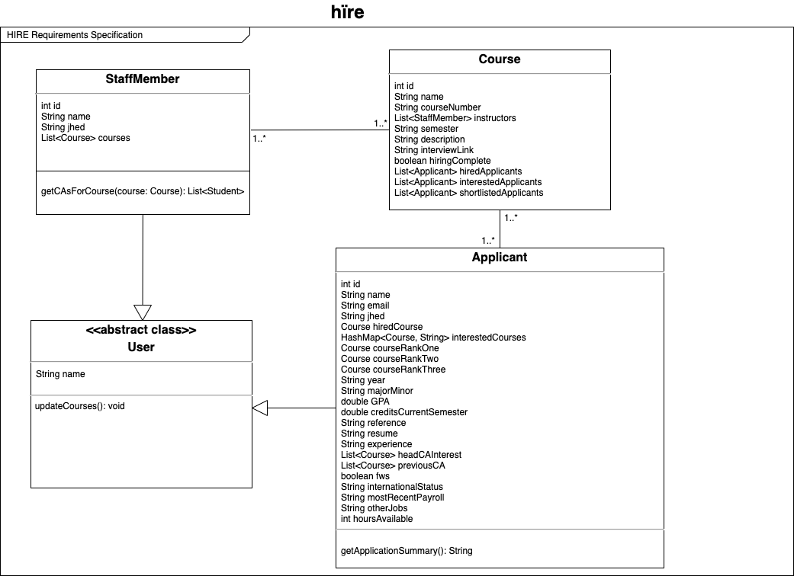
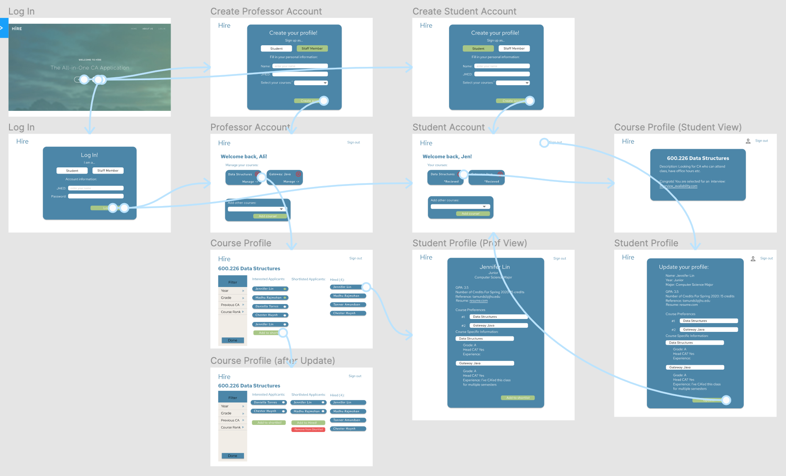

# OO Design
A UML class diagram reflecting the "model" for that iteration only.
Use a software to draw this (e.g. draw.io) and save the diagram as an image.
Upload the image and link it in here using this syntax.

# Wireframe
One (or a few) simple sketch of how the user interacts with the application.
This could be a sketch of your user interface.
You can draw it by hand and insert it here as an image.

# Iteration Backlog
List the User Stories that you will implement in this iteration.

- As a staff member, I’d like to see whether a student has CAd for that course, whether a student has taken courses that have the course as a prerequisite, and if the student has CA’d for the prerequisite course so that I can hire the right candidate.
- As a staff member looking to hire CAs, I want to note when I conduct interviews/hire students so that I can keep a better track of each application’s progress.
- As a staff member, I want to be able to shortlist applicants so that I can aggregate preferred candidates for a given course.
- As a CA applicant, I want changes to my application status to be displayed (application received, getting an interview, getting hired etc.) so I’m aware of the status of my application.
- As a CA applicant, I want to have an all-in-one and intuitive profile where I can input and update qualifications so that I can apply for many positions through one application across semesters.
  - As a CA applicant, I want to be able to input information about my experiences and preferences so that professors have more information about my application when considering me as a candidate.

# Tasks
A tentative list of the "to do" in order to sucessfully complete this iteration.
This list will change and it is good to keep it updated.
It does not need to be exhustive.

- Update New fields to `Applicant` class
  - Visible to `StaffMembers`
    - Year (Freshman, Sophomore, Junior, Senior): `String`
    - Major/Minor: `String`
    - GPA: `Double`
    - Number of credits for a given semester: `Double`
    - Email of faculty/employer reference: `String`
    - Link to resume: `String`
    - Experience: `String`
    - headCAInterest: List of Courses
  - Visible to `Admin` class (`Admin` class not implemented for iteration 3):
    - FWS eligibility: `bool`
    - Student status (Full-time US, Full-time Intl, Part-time Intl): `String`
    - Most recent semester of payroll: `String`
    - Other jobs: `String`
    - How many hours available?: `int`  
- New fields to `Course` class
    - Description: `String`
    - interviewLink: `String`
    - shortlistedApplicants: List of Applicants
- Interview scheduling
  - Update status for applicants to “interviewing”
  - Streamlined email generation
    - Staff member can email to shortlist of applicants
    - E.g. using Google scripts
  - Create course profile that applicants can view
    - Better descriptions of job responsibilities
    - Applicants can see application status
    - Shortlisted applicants can access scheduling link
- Shortlisting
  - In course view, allow staff members select from interested applicants column
    - Create third “Shortlisted Applicants” column
    - Professors can create shortlist and have “make link available” button
  - In student view, have form at bottom that allows adding interested applicants to shortlist
    - Button that says “add to shortlist”
    - Redirect to courseview with the updated shortlist column
    
    # Retrospective
    
    - Items we successfully delivered:
        - Added more fields to the applicant profile that rounds out their application
        - Added fields in Applicant class and updated our database to reflect the changes
        - Added course profile pages that are visible to both students and professors. 
        - Professors can now add descriptions of the course/responsibilities of the job of CAing that course
        - Applicants can view the course description
        - We added the ability for professors and students to add courses in their landing page - previously, all courses had to be added during sign-up and couldn’t be added later
        - Shortlisting
            - Added shortlists for each course in the POJOs and databases
            - Gave professors the ability to add applicants they are interested in to a shortlist for each course they teach
            - Happens in the course profile page visible to professors
            - Students can be added either via their profile page or via the course profile page
    - Items we did not successfully deliver
        - We did not get to add the feature for professors to send out mass emails to applicants they want to interview. Although we did make it possible for professors to add links to 3-rd party interview-scheduling sites for each of their courses and they can see applicant’s email by clicking on their profile.
        - We did not implement the backend part of letting applicants see when their application has moved forward (to the interview stage or hired stage). Although we did create the frontend view for that and will fix the backend functionality in iteration 4.
    - Challenges we faced
        - Our DAOs and databases are getting a bit cumbersome. Each time we add a new field to any of the classes, it is hard to scale our database to reflect the new additions.
            - In iteration 4 we are doing a major refactoring of our DAOs and database to simplify the schema and make the task of adding/removing fields in our classes as simple as changing 1 SQL query rather than changing all of our SQL queries and database schema.
        - We didn’t realize how short iteration 3 was and so we were not able to complete the two features discussed in item II above.
            - In future iterations, we will be more mindful of how much time we have and limit the number of new features we try to add at once.

