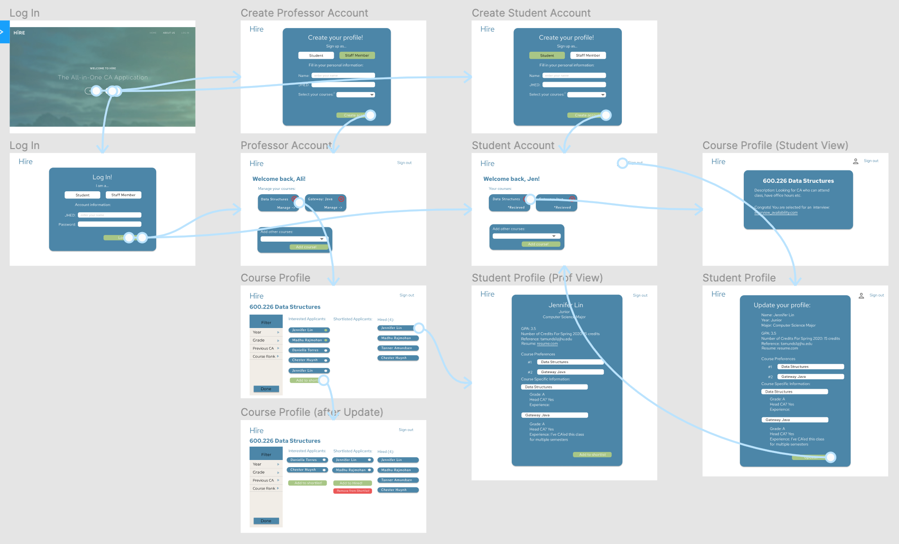

# OO Design
A UML class diagram reflecting the "model" for that iteration only.
Use a software to draw this (e.g. draw.io) and save the diagram as an image.
Upload the image and link it in here using this syntax.

# Wireframe
One (or a few) simple sketch of how the user interacts with the application.
This could be a sketch of your user interface.
You can draw it by hand and insert it here as an image.

# Iteration Backlog
List the User Stories that you will implement in this iteration.

- As a user of the CA application, I want to be able to log in so that only I can have access to my information.
- As a user of the CA application, I want to be able to delete courses off of my interested courses list so that I can update my list if necessary.
- As a staff member looking to hire CAs, I want to be able to delete applicants off of my shortlist so that I can narrow down the candidates.
- As a staff member looking to hire CAs, I want to be able to add applicants to my hired list so that I can finalize my hiring process.
- As a staff member looking to hire CAs, I want to filter CA applications based on the candidate's qualifications so that I can hire the right candidate.
  - As a staff member, I’d like to filter by student’s grade, year, if they have previously CAed and course preferences so that I can hire the right candidate.
- As a CA applicant, I want changes to my application status to be displayed (application received, getting an interview, getting hired etc.) so I’m aware of the status of my application.
- As a CA applicant, I want to easily see a staff member’s availability for interviews (e.g. staff member uploads SignUpGenius link) so that I can select meeting times that will work for both of us.

# Tasks
A tentative list of the "to do" in order to sucessfully complete this iteration.
This list will change and it is good to keep it updated.
It does not need to be exhustive.

- New fields in Applicant
  - previousCACourses: `List<Course>`
    - Add to `studentprofile.hbs`
    - Add to `studentview.hbs`
- Filtering
  - Criteria
    - Taken course/prerequisite courses?
    - Grade
    - Year
    - Head CA Interest?
    - Was a previous CA?
    - Is this a preferred course?
  - Implement in `courseinfo.hbs`
  - Only display students that match filter criteria
- Notifying application status updates and interview links
  - Email shortlisted applicants
- Login/Password with database or SIS/Outlook
- Allow applicants and staff members to remove courses from interested course list
- Allow staff members to add applicants to hired and remove them from shortlist
- Deploy to Heroku
- Add Postman test suite
