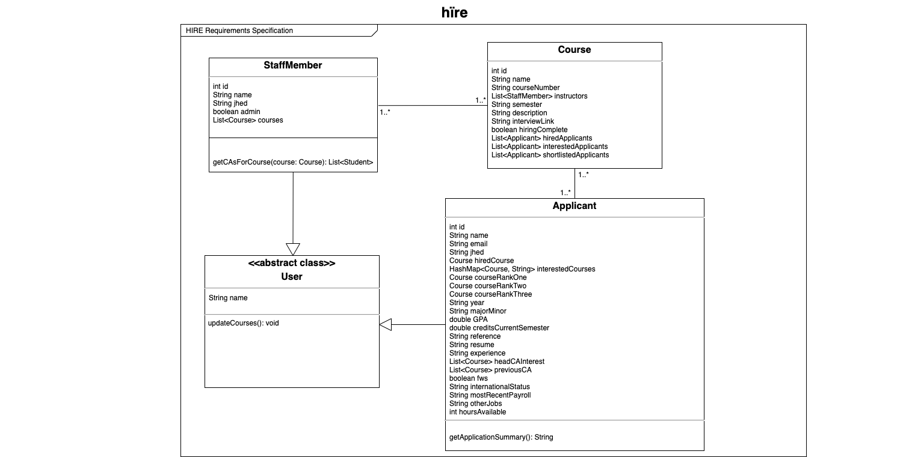
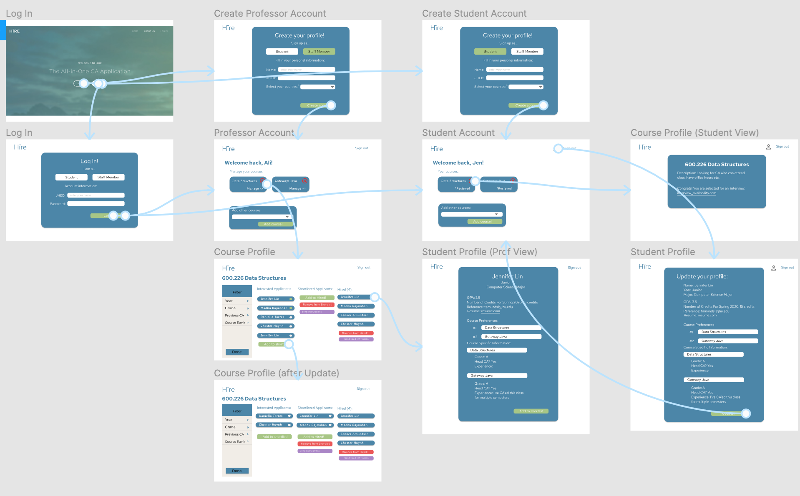

# OO Design
A UML class diagram reflecting the "model" for that iteration only.
Use a software to draw this (e.g. draw.io) and save the diagram as an image.
Upload the image and link it in here using this syntax.

# Wireframe
One (or a few) simple sketch of how the user interacts with the application.
This could be a sketch of your user interface.
You can draw it by hand and insert it here as an image.

# Iteration Backlog
List the User Stories that you will implement in this iteration.

- As a user of the CA application, I want to be able to log in so that only I can have access to my information.
- As a CA applicant, I want changes to my application status to be displayed (application received, getting an interview, getting hired etc.) so I’m aware of the status of my application.
- As a CA applicant, I want to easily see a staff member’s availability for interviews (e.g. staff member uploads SignUpGenius link) so that I can select meeting times that will work for both of us.
- As an admin, I want to be able to see the information that is not needed as a professor (e.g. international or not, work-study eligibility) so that I can offload the amount of information displayed to professors.
- As an admin, I want to be able to view the shortlists compiled for each course so that I can help resolve conflicts over popular applicants.
- As a website user, I want to see tooltips when I hover over important buttons so that I can avoid pressing buttons I shouldn’t

# Tasks
A tentative list of the "to do" in order to sucessfully complete this iteration.
This list will change and it is good to keep it updated.
It does not need to be exhustive.

- Login/Password with JHU authentication
- Notifying application status updates
  - On professor’s courseinfo:
    - Button to send interview link to shortlisted applicants
    - Button to send hiring notification to hired applicants
  - On student’s courseview, text to show status & link (if necessary)
- Add admin as a profile type
  - Allow admins to view extended version of student profile
  - Make admin-ship a boolean field in the StaffMember class
    - Admins “teach” all courses so they can see shortlist for all courses
- Filtering
  - Add options for year
- Handlebar
  - Optimize code by re-using templates for header and footer of website
- Deploy to Heroku
- Update Postman test suite (if necessary)
